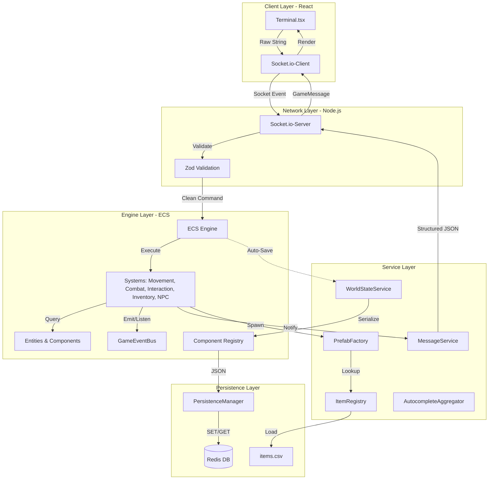

# Ouroboro: Technical Knowledge Base for AI Agents

Welcome, Architect. This document is your primary source of truth for the Ouroboro game engine. It is designed to provide you with an instant mental model of the system and "Golden Path" recipes for implementation.

---

## 🧠 The Mental Model

Ouroboro is a **High-Performance ECS (Entity-Component-System)** MUD (Multi-User Dungeon) built with Node.js and React.

### 1. Core Architecture
- **Entities**: Simple containers with a unique ID. They hold **Components**.
- **Components**: Pure data structures (classes) that inherit from `Component`. They must be serializable.
- **Systems**: Logic classes that inherit from `System`. They iterate over entities with specific component signatures.
- **Engine**: The orchestrator. It manages the entity list, component indexing, and system execution. Uses the `IEngine` interface to break circular dependencies and implements **Component Caching** for high-performance queries.
- **Event Bus**: A type-safe `GameEventBus` for decoupled communication between systems (e.g., `MovementSystem` emitting events that `NPCSystem` listens to).

### 2. The Game Loop
The server runs at **10 Ticks Per Second (TPS)**.
1. **Input**: Socket.io receives commands (validated by Zod).
2. **Update**: `engine.update(deltaTime)` runs all registered systems.
3. **Persistence**: `WorldStateService` saves entities to Redis every 30 seconds.
4. **Broadcast**: `MessageService` sends structured JSON updates to clients.

### 3. State & Persistence
- **Serialization**: Components use `toJSON()` and `fromJSON()`. Special care is taken for `Map` objects.
- **Registry**: `ComponentRegistry` maps string types to Class constructors for reconstruction.
- **Versioning**: Entities have a `version` field for schema migration.

### 4. System Architecture Diagram



---

## 🛠 Golden Path Implementation Recipes

### 📦 Adding a New Item
To add a "Neural Link" item:
1. **Data Layer**: Add a row to `server/data/items.csv`.
   ```csv
   neural_link,Neural Link,A sleek interface port.,0.1,1,legal,INT:2
   ```
2. **Prefab Factory**: Update `server/src/factories/PrefabFactory.ts`.
   ```typescript
   // Inside createItem
   if (def.type === 'cyberware') {
       entity.addComponent(new Cyberware(def.extraData));
   }
   ```
3. **Registry**: If you created a new component (e.g., `Cyberware`), register it in `server/src/ecs/ComponentRegistry.ts`.

### 🤖 Adding a New NPC
NPCs are created via the `PrefabFactory`:
1. **Factory**: Add a case to `PrefabFactory.createNPC`.
   ```typescript
   case 'cyber_merchant':
       entity.addComponent(new NPC(
           "Cyber Merchant",
           ["Best deals in the sprawl!", "Need a neural upgrade?"],
           "A merchant with more chrome than flesh."
       ));
       entity.addComponent(new CombatStats(100, 10, 20));
       break;
   ```
2. **Spawning**: Add the ID to `getSpawnableNPCs()` in the factory.
3. **World Gen**: Use `this.spawnNPC(x, y, type)` in `WorldGenerator.ts`.

### ⌨️ Adding a New Command
Commands are registered in the `CommandRegistry`:
1. **Interface**: Commands must implement the `Command` interface.
2. **Registration**: Add to `server/src/index.ts`.
   ```typescript
   commandRegistry.register({
       name: 'shout',
       aliases: ['yell'],
       description: 'Shout a message to the room',
       execute: (ctx) => {
           const msg = ctx.args.join(' ');
           ctx.messageService.info(ctx.socketId, `You shout: ${msg}`);
           // Broadcast logic here...
       }
   });
   ```
3. **Context**: Use `ctx.systems` to access other systems and `ctx.messageService` for all output.
   ```typescript
   // Example: Accessing inventory from a command
   ctx.systems.inventory.handleGet(ctx.socketId, itemName, ctx.engine);
   ```

### 📡 Event-Driven Communication
Use the `GameEventBus` to decouple systems:
1. **Define Event**: Add to `GameEventType` and `GameEventPayloads` in `GameEventBus.ts`.
2. **Emit**: `GameEventBus.getInstance().emit(GameEventType.PLAYER_MOVED, { ... })`.
3. **Listen**: Subscribe in a system's constructor:
   ```typescript
   GameEventBus.getInstance().on(GameEventType.PLAYER_MOVED, (payload) => {
       this.onPlayerMoved(payload);
   });
   ```

### 🧪 Testing Framework
Ouroboro uses **Jest** for unit testing:
- **Location**: Tests are located in `**/__tests__/*.test.ts`.
- **Running**: Use `npm test` to run the suite.
- **Mocking**: Use `jest.mock('uuid')` or similar for deterministic tests.
- **Config**: `jest.config.js` handles TypeScript transformation and module mapping.

### 🔍 Implementing Tab Completion
Autocomplete is a two-part system:
1. **Server-side**: `AutocompleteAggregator.ts` gathers valid targets (NPCs, Items, Containers) based on player location/inventory.
2. **Client-side**: `Terminal.tsx` maintains a `COMMANDS` list and cycles through matches on `Tab`.
   - **Adding a Command**: Add the string to the `COMMANDS` array in `Terminal.tsx`.
   - **Adding an Argument**: Update the `handleKeyDown` logic in `Terminal.tsx` to handle specific command argument matching.

### 🗺 Growing the Map
To add a new "Black Market" room:
1. **Layout**: Update `server/src/world/WorldGenerator.ts`.
   ```typescript
   // In createLayout
   layout[y][x] = 8; // 8 = Black Market
   ```
2. **Flavor**: Add to `getRoomFlavor`.
   ```typescript
   case 8:
       return { title: "The Black Market", desc: "A dimly lit basement filled with illegal tech." };
   ```
3. **Logic**: Add spawns in `createRoom`.
   ```typescript
   if (type === 8) {
       this.spawnNPC(x, y, type); // Spawns thugs/dealers
   }
   ```

### 🧩 Adding a Puzzle
Puzzles follow the **State-Check Pattern**:
1. **Component**: Attach `PuzzleObject` to an entity.
   ```typescript
   entity.addComponent(new PuzzleObject("gravity_puzzle", "up", "down"));
   ```
2. **Interaction**: Add a command handler in `server/src/services/PuzzleManager.ts`.
   ```typescript
   handleFlip(entityId: string, target: string) {
       // Logic to change PuzzleObject state
       this.checkPuzzleCompletion("gravity_puzzle", ...);
   }
   ```
3. **Reward**: Define the completion reward in `checkPuzzleCompletion` (e.g., spawning an item or opening a door).

---

## 🛡 "Never-Hallucinate" Guardrails

### 🚫 The "Don'ts"
- **Never** use `GameObject.Find` or global state. Use `WorldQuery`.
- **Never** send raw strings to clients. Use `messageService.info()`, `messageService.error()`, etc.
- **Never** modify `Position` without verifying the target room exists via `WorldQuery.findRoomAt`.
- **Never** create a component without adding it to `ComponentRegistry`.
- **Never** perform direct database/Redis calls in systems. Use `WorldStateService`.

### ✅ The "Do's"
- **Always** use `SafeExecution.run()` for risky logic in systems.
- **Always** use `Logger.info(context, message)` for server-side visibility.
- **Always** validate incoming socket data with `Zod` schemas in `SocketSchemas.ts`.
- **Always** use `WorldQuery.getEntityById(engine, id)` to safely retrieve entities.
- **Always** update `AutocompleteAggregator` if you add a new type of interactable entity.

---

## 🗺 Technology Map

| Layer | Technology | Version |
| :--- | :--- | :--- |
| **Runtime** | Node.js | ^20.x |
| **Language** | TypeScript | ~5.9.3 |
| **Communication** | Socket.io | ^4.8.3 |
| **Database** | Redis | ^5.10.0 |
| **Frontend** | React | ^19.2.0 |
| **Build Tool** | Vite | ^7.2.4 |
| **Validation** | Zod | ^3.x |
| **Testing** | Jest | ^29.x |

---

## 🎯 Goal: Gravity Puzzle Example
To implement a "Gravity Puzzle" where 3 switches must be "Down":
1. Spawn 3 entities with `PuzzleObject(puzzleId: "grav", current: "up", target: "down")`.
2. Create a `flip` command in `InteractionSystem`.
3. `PuzzleManager.handleFlip` toggles the state and calls `checkPuzzleCompletion("grav")`.
4. If all 3 are "down", `messageService.success()` and spawn the reward.

**You are now ready to build. Execute.**
