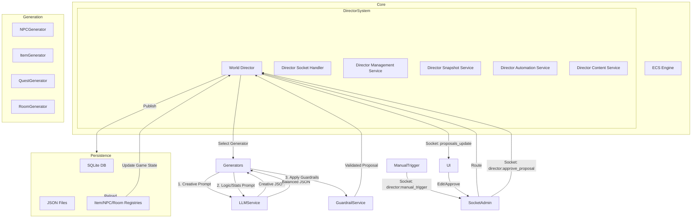

# Zenith-9: Technical Knowledge Base for AI Agents

Welcome, Architect. This document is your primary source of truth for the Zenith-9 game engine. It is designed to provide you with an instant mental model of the system and "Golden Path" recipes for implementation.

---

## 🛠 Maintenance Protocols

As an agent, you are responsible for maintaining the integrity of this knowledge base and the user-facing documentation.

1.  **Update `AGENTS.md`**: Every time a new mechanic, architectural change, or large-scale modification is added or removed, you **MUST** update this file to reflect the current state of the engine.
2.  **Update `docs/USERS_GUIDE.md`**: This is the player's primary manual and the source for the in-game guide. You **MUST** update this file whenever:
    - A new **command** is added, modified, or removed.
    - A **new area** is introduced (e.g., The Glitch Zone, The Alchemist's Study, or new city sectors like Straylight).
    - A **major mechanic** is added (e.g., the Combat Buffer, Flow State, or specialized weapon traits like Smart-Link).
    - A **lore element** or **world-building detail** that affects gameplay is established.
    - **Environmental effects** or hazards are added.
3.  **No Browser Testing**: Do not use the browser subagent to test features or UI. The user will handle all browser-based verification.

### 🔄 Server Management Scripts

The `server/` directory contains PowerShell scripts for managing the server process. **Use these instead of manual process management**:

- **`start_server.ps1`**: Starts the development server with `npm run dev`
- **`restart_server.ps1`**: Kills any process on port 3000 and starts a fresh server instance
- **`kill_server.ps1`**: Terminates all processes listening on port 3000

**Usage**: When you need to restart the server (e.g., after code changes that don't auto-reload), use:
```powershell
.\server\restart_server.ps1
```

**Note**: The server uses `nodemon` which auto-restarts on file changes in `src/**/*`. Manual restarts are only needed for:
- Changes to `package.json` dependencies
- Changes to configuration files outside `src/`
- When the server crashes or hangs
- When a manual database reset is required

### 👑 Special Entities

- **`pho`**: This is a **God Character**. 
    - **Role**: Automatically assigned the `god` role upon registration.
    - **Persistence**: Hard-coded protection in `AuthService.ts` prevents this user from being deleted via admin tools or scripts.
    - **Purpose**: Primary administrative and testing persona.

## 🏗 System Architecture



### 6. The Admin Dashboard (`/admin`)
The Admin Dashboard is a powerful web-based tool for managing the game world in real-time. It connects to the server via a dedicated `socket.io` namespace (`/admin`).

#### Features:
- **World Map**: Visual grid of generated chunks. Allows manual generation and deletion of chunks.
- **Item Registry**: View, search, edit, and delete all items in the game.
- **NPC Registry**: View, search, edit, and delete all NPCs.
- **Pending Proposals**: Review, edit, approve, or reject AI-generated content.
- **Manual Generation**: Buttons to manually trigger generation of NPCs, Mobs, Items, Quests, and Rooms.
- **Snapshots**: Create and restore full world backups.
- **LLM Configuration**: Manage AI profiles and connection settings.

#### Mob Generation
The "Generate Mob" feature is a specialized subset of NPC generation:
- **Trigger**: `director:manual_trigger` with type `MOB`.
- **Logic**: Uses `NPCGenerator` with a `subtype: 'MOB'` context.
- **Archetypes**: Selects from creature-specific archetypes (Vermin, Glitch Construct, etc.).
- **Behavior**: Forces `aggressive` behavior.
- **Dialogue**: Generates creature sounds instead of speech.
- **Loot**: 20% chance to carry `RARE` items.

- **Loot Dropping**: Integrated into `AttackHandler.ts`. When an NPC dies, it drops its `Inventory` and `Loot` component items to the ground.

#### World Expansion & Room Generation
The world grows dynamically through the `RoomGenerator`:
- **Trigger**: `director:manual_trigger` with type `WORLD_EXPANSION` or clicking an empty cell on the Admin Map.
- **Logic**:
    1. **Coordinate Selection**: If triggered via the map, it uses the specific (x, y). If triggered via the "Expansion" button, it picks random coordinates between 0-100.
    2. **Type Selection**: Randomly selects a theme (Street, Shop, Dungeon, Indoor).
    3. **LLM Generation**: Generates a unique name and sensory-rich description.
- **Approval**: New rooms appear as proposals. Upon approval, they are:
    1. Saved to `server/data/generated/world_expansions/`.
    2. Registered in the `RoomRegistry`.
    3. Instantiated as live entities in the `Engine`.
- **Exits**: Currently, rooms are generated as standalone nodes. Exits are typically handled by the `MovementSystem` which allows travel between adjacent coordinates (N/S/E/W) even if explicit "exit" components aren't present, provided a room exists at the target coordinates.

#### World Events System
The World Director can trigger both hostile and peaceful events that affect all players globally.

**Event Architecture**:
- **Trigger**: `director:manual_trigger` with event type, or `triggerWorldEvent(eventType, force, durationOverride)`
- **Duration**: Events are tracked in `activeEvents` array with automatic cleanup via `checkActiveEvents()`
- **Announcements**: Global messages sent to all players via `io.emit('message', ...)` at start and end
- **Entity Tracking**: Event entities are stored with the event ID for cleanup when the event expires

**Hostile Events**:
- **MOB_INVASION** (30 min): Spawns 10-20 aggressive mobs at random coordinates. Mobs have 20% chance for RARE loot.
- **BOSS_SPAWN** (15 min): Generates a boss NPC with 5x health, 2x attack/defense, guaranteed legendary loot.

**Peaceful Events** (20 min default):
- **TRAVELING_MERCHANT**: 
    - Spawns passive merchant NPC with 3-5 rare/epic items
    - Items auto-generated and added to merchant's equipment
    - Merchant spawns at random coordinates (10±5, 10±5)
    - Context: "A wandering merchant with rare and exotic cyberpunk goods..."
- **DATA_COURIER**:
    - Spawns passive courier NPC with delivery quest
    - Generates mysterious package item
    - Context: "A nervous courier with an urgent package delivery..."
    - TODO: Quest system integration for actual delivery mechanics
- **SCAVENGER_HUNT**:
    - Spawns mysterious NPC with cryptic dialogue
    - Generates legendary treasure item
    - Context: "A mysterious hooded figure who speaks in riddles..."
    - TODO: Clue chain system for multi-step treasure hunt

**Implementation Notes**:
- All peaceful events use `force: true` to bypass approval requirements
- Events auto-publish NPCs and items to registries
- Event cleanup removes all tracked entities when duration expires
- Each event type has unique start/end announcement messages

---

## 🛠 Golden Path Implementation Recipes

### 📦 Adding a New Item
The game uses a **SQLite database** (`game.db`) as the primary item repository, seeded by `server/src/db/seed.ts`.
- **Core Items**: Defined in `server/src/db/seed.ts`. To add a permanent item, add it here and restart the server (which re-runs the seed).
- **Generated Items**: Stored as JSON in `server/data/generated/items/`.
- **Active State**: `redis_dump.json` contains the *current* state of entities in the game world. Do not confuse this with item definitions.

Items are loaded by `ItemRegistry` (from both SQLite and JSON) and instantiated by `PrefabFactory`.

#### Item Types
- **`item`**: General items (consumables, quest items, ammo)
- **`weapon`**: Combat weapons (requires `Weapon` component)
- **`armor`**: Wearable armor (requires `Armor` component)
- **`cyberware`**: Neural/body implants (requires `Cyberware` component)
- **`container`**: Storage items like backpacks (requires `Container` component)

#### Adding a Weapon
1. **Add to `items.json`**:
   ```json
   {
       "id": "99",
       "name": "plasma_cutter",
       "shortName": "Plasma Cutter",
       "description": "A high-energy cutting tool.",
       "weight": 3.0,
       "size": "Medium",
       "legality": "Restricted",
       "attributes": "Melee Weapon; Ignores armor.",
       "cost": 2500,
       "type": "weapon",
       "extraData": {
           "damage": 35,
           "range": 0,
           "minTier": "melee",
           "maxTier": "close quarters",
           "momentumImpact": 0.4,
           "roundtime": 3,
           "difficulty": { "speed": 1.2, "zoneSize": 3, "jitter": 0.2 }
       }
   }
   ```
2. **Add to Shop** (optional): Update `WorldGenerator.ts` shop terminal items array.
3. **Update COMPENDIUM.md**: Document the new weapon with stats.

#### Adding Armor
**CRITICAL**: Armor items store their slot in `extraData.slot`, not at the top level!

1. **Add to `items.json`**:
   ```json
   {
       "id": "100",
       "name": "tactical_vest",
       "shortName": "Tactical Vest",
       "description": "Lightweight kevlar vest.",
       "weight": 2.0,
       "size": "Medium",
       "legality": "Legal",
       "attributes": "Torso Armor; Medium Defense, Low Penalty.",
       "cost": 1500,
       "type": "armor",
       "extraData": {
           "defense": 8,
           "penalty": 1,
           "slot": "torso"
       }
   }
   ```
   **Valid Slots**: `head`, `torso`, `back`, `waist`, `legs`, `feet`
   
2. **Armor Mechanics**:
   - `defense`: Added to defender's power in combat calculations
   - `penalty`: Subtracted from defender's power (represents agility loss)
   - Equipped armor is checked in `CombatSystem.calculateDefenderPower()`

3. **Add to Shop** (optional): Add to The Armory in `WorldGenerator.ts`.
4. **Update COMPENDIUM.md**: Document with defense/penalty stats.

#### Adding Cyberware
1. **Add to `items.json`**:
   ```json
   {
       "id": "101",
       "name": "neural_boost",
       "shortName": "Neural Boost Chip",
       "description": "Enhances cognitive processing.",
       "weight": 0.01,
       "size": "Tiny",
       "legality": "Legal",
       "attributes": "Neural Cyberware; +2 INT.",
       "cost": 3000,
       "type": "cyberware",
       "extraData": {
           "slot": "neural",
           "modifiers": { "INT": 2 }
       }
   }
   ```

#### Adding a Container
**CRITICAL**: Containers need `slot` at the TOP level (not in extraData) AND in extraData!
1. **Add to `items.json`**:
   ```json
   {
       "id": "102",
       "name": "tactical_backpack",
       "shortName": "Tactical Backpack",
       "description": "Military-grade storage.",
       "weight": 2.0,
       "size": "Large",
       "legality": "Legal",
       "attributes": "Container; 30kg capacity.",
       "cost": 200,
       "type": "container",
       "slot": "back",
       "extraData": { "capacity": 30 }
   }
   ```

#### Registry & Components
- **No code changes needed** for standard item types (weapon, armor, cyberware, container)
- `PrefabFactory.createItem()` automatically handles all standard types
- If creating a **new component type**, register it in `ComponentRegistry.ts`

### 🤖 Adding a New NPC
NPCs are created via the `PrefabFactory`:
1. **Factory**: Add a case to `PrefabFactory.createNPC`.
   ```typescript
   case 'cyber_merchant':
       entity.addComponent(new NPC(
           "Cyber Merchant",
           ["Best deals in the sprawl!", "Need a neural upgrade?"],
           "A merchant with more chrome than flesh."
       ));
       entity.addComponent(new CombatStats(100, 10, 20));
       break;
   ```
2. **Spawning**: Add the ID to `getSpawnableNPCs()` in the factory.
3. **World Gen**: Use `this.spawnNPC(x, y, type)` in `WorldGenerator.ts`.

### ⌨️ Adding a New Command
Commands are registered in the `CommandRegistry`:
1. **Interface**: Commands must implement the `Command` interface.
2. **Registration**: Add to `server/src/index.ts`.
   ```typescript
   commandRegistry.register({
       name: 'shout',
       aliases: ['yell'],
       description: 'Shout a message to the room',
       execute: (ctx) => {
           const msg = ctx.args.join(' ');
           ctx.messageService.info(ctx.socketId, `You shout: ${msg}`);
           // Broadcast logic here...
       }
   });
   ```
3. **Context**: Use `ctx.systems` to access other systems and `ctx.messageService` for all output.
   ```typescript
   // Example: Accessing inventory from a command
   ctx.systems.inventory.handleGet(ctx.socketId, itemName, ctx.engine);
   ```
4. **Special Flags**:
    - `ignoresRoundtime: true`: Allows the command to be executed even if the player is currently in roundtime (e.g., `stop`).

### 💊 Consumables & The 'Use' Command
Consumables are handled by the `InventorySystem.handleUse` method.
1. **Logic**: The system checks the player's hands and equipment (containers) for the item.
2. **Effects**: Effects are hardcoded in `handleUse` based on the item name (e.g., `medkit`, `stimpack`).
3. **Consumption**: Items are removed from the world and inventory using `consumeItem`.

### 🩸 NPC Health & Feedback
The game uses a **Descriptive Health System** for NPCs, hiding exact HP values from players.
1. **Utility**: Use `HealthDescriptor.ts` to convert HP/Damage to strings.
   - `getDamageDescriptor(damage)`: Returns severity (e.g., "Solid Hit").
   - `getStatusDescriptor(hp, maxHp)`: Returns status (e.g., "Wounded").
   - `getDetailedStatus(combatStats, maxFatigue)`: Returns status + fatigue.
2. **Usage**:
   - **Combat**: In `AttackHandler`, log severity instead of damage numbers.
   - **Observation**: In `DescriptionService`, append status to NPC descriptions.
   - **Tooltips**: In `index.ts`, send status string instead of "HP/MaxHP".

### 📡 Event-Driven Communication
Use the `GameEventBus` to decouple systems:
1. **Define Event**: Add to `GameEventType` and `GameEventPayloads` in `GameEventBus.ts`.
2. **Emit**: `GameEventBus.getInstance().emit(GameEventType.PLAYER_MOVED, { ... })`.
3. **Listen**: Subscribe in a system's constructor:
   ```typescript
   GameEventBus.getInstance().on(GameEventType.PLAYER_MOVED, (payload) => {
       this.onPlayerMoved(payload);
   });
   ```

### 🧪 Testing Framework
Zenith-9 uses **Jest** for unit testing:
- **Location**: Tests are located in `**/__tests__/*.test.ts`.
- **Running**: Use `npm test` to run the suite.
- **Mocking**: Use `jest.mock('uuid')` or similar for deterministic tests.
- **Config**: `jest.config.js` handles TypeScript transformation and module mapping.

### 🔍 Implementing Tab Completion
Autocomplete is a two-part system:
1. **Server-side**: `AutocompleteAggregator.ts` gathers valid targets (NPCs, Items, Containers) based on player location/inventory.
2. **Client-side**: `Terminal.tsx` maintains a `COMMANDS` list and cycles through matches on `Tab`.
   - **Adding a Command**: Add the string to the `COMMANDS` array in `Terminal.tsx`.
   - **Adding an Argument**: Update the `handleKeyDown` logic in `Terminal.tsx` to handle specific command argument matching.

### 🗺 Growing the Map
To add a new "Black Market" room:
1. **Layout**: Update `server/src/world/WorldGenerator.ts`.
   ```typescript
   // In createLayout
   layout[y][x] = 8; // 8 = Black Market
   ```
2. **Flavor**: Add to `getRoomFlavor`.
   ```typescript
   case 8:
       return { title: "The Black Market", desc: "A dimly lit basement filled with illegal tech." };
   ```
3. **Logic**: Add spawns in `createRoom`.
   ```typescript
   if (type === 8) {
       this.spawnNPC(x, y, type); // Spawns thugs/dealers
   }
   ```

### 🌐 Cyberspace & The Matrix
The Matrix is implemented as a **Mirror World** with a coordinate offset.
- **Coordinate Offset**: Cyberspace exists at `x + 10000`. Every physical room has a corresponding digital node.
- **Persona**: Use the `IsPersona` component to track the active neural link.
- **Jacking Mechanics**: Managed by `CyberspaceSystem.ts`.
    - `jack_in`: Moves player to offset, sets physical body to `Stasis`, adds `IsPersona`, and emits `cyberspace-state` to the client.
    - `jack_out`: Restores position and stance, removes `IsPersona`.
- **Client Transformation**: When `isMatrixMode` is true, the client applies the `.matrix-mode` CSS class and renders the `MatrixBackground3D` component.
- **ICE**: Digital enemies (ICE) use the `IsICE` and `IsCyberspace` components.

---

### 🧩 Adding a Puzzle
Puzzles follow the **State-Check Pattern**:
1. **Component**: Attach `PuzzleObject` to an entity.
   ```typescript
   entity.addComponent(new PuzzleObject("gravity_puzzle", "up", "down"));
   ```
2. **Interaction**: Add a command handler in `server/src/services/PuzzleManager.ts`.
   ```typescript
   handleFlip(entityId: string, target: string) {
       // Logic to change PuzzleObject state
       this.checkPuzzleCompletion("gravity_puzzle", ...);
   }
   ```
3. **Reward**: Define the completion reward in `checkPuzzleCompletion` (e.g., spawning an item or opening a door).

---

## 🛡 "Never-Hallucinate" Guardrails

### 🚫 The "Don'ts"
- **Never** use `GameObject.Find` or global state. Use `WorldQuery`.
- **Never** send raw strings to clients. Use `messageService.info()`, `messageService.error()`, etc.
- **Never** modify `Position` without verifying the target room exists via `WorldQuery.findRoomAt`.
- **Never** create a component without adding it to `ComponentRegistry`.
- **Never** perform direct database/Redis calls in systems. Use `WorldStateService`.

### ✅ The "Do's"
- **Always** use `SafeExecution.run()` for risky logic in systems.
- **Always** use `Logger.info(context, message)` for server-side visibility.
- **Always** validate incoming socket data with `Zod` schemas in `SocketSchemas.ts`.
- **Always** use `WorldQuery.getEntityById(engine, id)` to safely retrieve entities.
- **Always** update `AutocompleteAggregator` if you add a new type of interactable entity.

---

## 🗺 Technology Map

| Layer | Technology | Version |
| :--- | :--- | :--- |
| **Runtime** | Node.js | ^20.x |
| **Language** | TypeScript | ~5.9.3 |
| **Communication** | Socket.io | ^4.8.3 |
| **Database** | SQLite (better-sqlite3) | ^11.x |
| **Frontend** | React | ^19.2.0 |
| **Build Tool** | Vite | ^7.2.4 |
| **Validation** | Zod | ^3.x |
| **Testing** | Jest | ^29.x |

---

## 🎯 Goal: Gravity Puzzle Example
To implement a "Gravity Puzzle" where 3 switches must be "Down":
1. Spawn 3 entities with `PuzzleObject(puzzleId: "grav", current: "up", target: "down")`.
2. Create a `flip` command in `InteractionSystem`.
3. `PuzzleManager.handleFlip` toggles the state and calls `checkPuzzleCompletion("grav")`.
4. If all 3 are "down", `messageService.success()` and spawn the reward.

**You are now ready to build. Execute.**

---

### Recent Modifications (2026-01-17)
*   **Authentication System**: Implemented `AuthService` (JWT/Bcrypt) and `DatabaseService` (SQLite) for persistent user accounts.
*   **Character Creation**: Added `CharacterService` with archetypes (Street Samurai, Netrunner, Gutter Punk) and persistent storage.
*   **Multiplayer Presence**: Updated `MovementSystem` and `ObservationSystem` to handle real-time room presence and player visibility.
*   **Social Commands**: Added `say`, `link` (global), and `emote` commands.
*   **UI Overlays**: Created `AuthOverlay.tsx` for login/registration and character initialization.
*   **Phase 5 Mechanics**:
    *   **Reputation**: Added `Reputation` component to track faction standing.
    *   **Heat**: Implemented `HeatSystem` and component to track law enforcement attention.
    *   **Humanity**: Added `Humanity` component to track cyberware costs and cyberpsychosis risk.
*   **Phase 6 Security**:
    *   **Rate Limiting**: Implemented `RateLimiter` middleware to prevent command spam.
    *   **RBAC**: Added `Role` component and implemented Role-Based Access Control for admin commands.
    *   **Admin Security**: Implemented JWT-based authentication for the `/admin` socket namespace. Only users with `god` or `admin` roles can connect.
    *   **User Management**: Added backend support and Frontend UI (`UsersTab`) for listing/editing users, and managing their Characters (Stats, Reputation).
    *   **Director Refactor**:
        *   **Modular Architecture**: Split `WorldDirector` into specialized services: `SocketHandler`, `Management`, `Snapshot`, `Automation`, and `Content`.
        *   **Service-Oriented**: `WorldDirector` is now a thin orchestrator, delegating logic to these sub-services.

### Persistence Update
*   **SQLite**: Now the primary source of truth for Users, Characters, and World Entities.
*   **Redis**: Reserved for pub/sub and transient session data (if needed), but core persistence is now SQLite-based.

### Authentication & Character Flow
1.  **Connection**: Socket connects, but no entity is spawned.
2.  **Auth**: Client uses `auth:login` or `auth:register`.
3.  **Character**: If no character exists, client uses `char:create` with an archetype.
4.  **Game Start**: Client emits `game:start` with JWT. Server instantiates the character from DB and spawns the entity.

### Social System
*   **Rooms**: Players are grouped into Socket.io rooms based on coordinates (`room:x:y`).
*   **Presence**: Arrival/Departure messages are broadcast to the room.
*   **Visibility**: `look` command and room descriptions now include other players.

