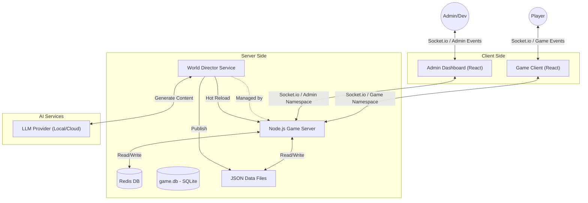

# Zenith-9

A cyberpunk-themed MUD (Multi-User Dungeon) with an innovative **Neural Pulse** timing-based combat system.

## 🎮 Features

### 🖥️ Modern Cyberpunk Interface
Zenith-9 bridges the gap between classic MUDs and modern RPGs with a high-fidelity, reactive UI:

- **Dynamic Portraits**: AI-generated character art for NPCs, bringing the inhabitants of Zenith-9 to life.
- **Mouse-Over Tooltips**: Hover over items in your inventory or NPCs in the room to see detailed stats, descriptions, and combat data instantly.
- **Real-time Nav Map**: A persistent, live-updating map of your surroundings with point-of-interest markers.
- **Rich Character Sheets**: Detailed visualization of attributes, combat stats, and skill progression.


*The modern Zenith-9 interface featuring dynamic portraits and character data.*


*Advanced mouse-over tooltips for inventory management.*

### 🎯 Neural Pulse Combat System
A revolutionary timing-based combat system that rewards skill and precision:

- **Animated Sync Bar**: A high-stakes timing mini-game. Press `SPACE` or `F` when the cursor hits the sweet spot to land devastating blows.
- **Combat Buffer (`COMBAT_BUFFER.EXE`)**: Queue up multiple maneuvers (Slice, Stumble, etc.) and execute them in a fluid sequence.
- **Flow & Momentum**: Successful strikes build **Flow**, unlocking advanced techniques and increasing your combat effectiveness.
- **Combat Assessment**: Real-time tactical overlay showing your balance, stamina, and your target's status.
- **System Breach Effects**: Critical hits can trigger unique debuffs like Neural Feedback, Optic Glitch, and Armor Shred.


*High-intensity combat featuring the Sync Bar and Tactical Assessment.*


*The Combat Buffer executing a sequence of maneuvers.*

### 🏙️ World & NPCs
- **Persistent World**: A 20x20 procedurally generated city with diverse zones (Plazas, Nightclubs, Ripperdoc Clinics).
- **Living Ecosystem**: NPCs with dynamic dialogue, unique behaviors, and AI-driven life cycles.
- **MMO Foundation**: Built for high-concurrency multiplayer with Redis-backed persistence.

### 🌀 The Glitch Door (Procedural Dungeons)
Located in the heart of the Central Plaza (10,10), the **Glitch Door** offers a gateway to unstable, procedurally generated reality pockets.
- **Roguelike Runs**: Enter a temporary instance filled with "Glitch" enemies and distorted environments.
- **High Risk, High Reward**: Survive the instability to find unique `[GLITCH]` prefixed items with legendary stats.
- **AI-Generated Content**: The World Director generates unique mobs and loot for each run, ensuring no two delves are the same.

---

## 📖 Technical Documentation

For developers and AI agents, please refer to [AGENTS.md](./AGENTS.md). It contains:
- **Full System Architecture Diagram** (Mermaid)
- **Mental Model** of the engine and game loop
- **Golden Path Recipes** for adding items, NPCs, commands, and puzzles
- **Guardrails** for maintaining system stability

---

## 🚀 Quick Start

### Prerequisites
- Node.js 18+
- Redis server
- npm or yarn

### Installation

```bash
# Clone the repository
git clone https://github.com/phobosd/Ourobouro.git
cd Zenith-9

# Install server dependencies
cd server
npm install

# Install client dependencies
cd ../client
npm install
```

### Running the Game

**Terminal 1 - Start Redis:**
```bash
docker-compose up redis
```

**Terminal 2 - Start Server:**
```bash
cd server
npm run dev
```

**Terminal 3 - Start Client:**
```bash
cd client
npm run dev
```

Navigate to `http://localhost:5173` in your browser.

## 🎮 How to Play

For a comprehensive guide on commands, combat, and game mechanics, please refer to the [User's Guide](./docs/USERS_GUIDE.md).

## 🏗️ Architecture

### Overarching System Diagram
The Zenith-9 ecosystem consists of the Game Client, Game Server, Admin Dashboard, and external AI services.



### Tech Stack
- **Frontend**: React + TypeScript + Socket.io-client
- **Backend**: Node.js + TypeScript + Socket.io
- **Database**: 
    - **Redis**: For real-time world state and active entity persistence.
    - **SQLite**: For persistent user accounts and character data.
- **Authentication**: JWT-based with Bcrypt password hashing.
- **Architecture**: Entity Component System (ECS)
- **AI Integration**: Custom LLM Service with Guardrails

### 🛠️ Admin Dashboard (`/admin`)
Zenith-9 includes a comprehensive Admin Dashboard for real-time world management and content generation.
- **World Map**: Visualize and manage procedurally generated chunks.
- **Content Registry**: Search, edit, and delete Items and NPCs live.
- **AI Director**: Manually trigger generation of new content (NPCs, Mobs, Items, Quests, Rooms).
- **Review Pipeline**: Approve or reject AI-generated content before it enters the game.
- **User Management**: Manage user accounts, roles, and permissions.
- **Security**: Role-Based Access Control (RBAC) and JWT authentication for admin actions.
- **Snapshots**: Backup and restore the entire world state.

For a detailed guide on using the dashboard, see the [Admin Guide](./docs/ADMIN_GUIDE.md).

### Project Structure
```
Zenith-9/
├── client/               # React frontend
│   ├── src/
│   │   ├── components/   # UI components
│   │   │   ├── Terminal.tsx
│   │   │   └── CombatOverlay.tsx
│   │   └── App.tsx
│   └── package.json
├── server/               # Node.js backend
│   ├── src/
│   │   ├── ecs/          # Entity Component System
│   │   ├── components/   # Game components
│   │   ├── systems/      # Game systems
│   │   ├── commands/     # Command modules
│   │   ├── world/        # World generation & factories
│   │   ├── factories/    # Entity factories
│   │   └── persistence/  # Redis integration
│   └── package.json
└── docker-compose.yml    # Redis setup
```

## 🎨 Combat System Details

### Weapon Difficulty
Each weapon has a `SyncDifficulty` that affects the timing challenge:
```typescript
{
  speed: 1.2,      // Cursor movement speed
  zoneSize: 2,     // Base crit zone width
  jitter: 0.1      // Random jump chance (10%)
}
```

### Difficulty Scaling
- **Agility**: Higher AGI = wider crit zone
- **Skill Level**: Higher Marksmanship = slower cursor
- **Weapon Type**: Different weapons have different sync parameters

### System Breach Effects (Critical Hits)
1. **Neural Feedback** - Stuns target
2. **Optic Glitch** - Reduces target accuracy
3. **Armor Shred** - Permanent defense reduction
4. **Ammo Cook-off** - Fire damage over time
5. **Actuator Lock** - Reduces target agility

## 🛠️ Development

### Server Scripts
```bash
npm run dev      # Development with hot reload
npm run build    # Build for production
npm start        # Run production build
```

### Client Scripts
```bash
npm run dev      # Development server
npm run build    # Build for production
npm run preview  # Preview production build
```

### Utility Scripts
```bash
# Kill server process on port 3000 (Windows)
powershell -ExecutionPolicy Bypass -File server/kill_server.ps1
```

## 📝 License

MIT

## 🤝 Contributing

Contributions welcome! Please feel free to submit a Pull Request.

## 🎯 Roadmap

- [ ] Enemy AI and counter-attacks
- [ ] More weapon types and combat variations
- [ ] Crafting system
- [ ] Quest system
- [ ] Player-vs-Player combat
- [ ] Cybernetic augmentations
- [ ] Hacking mini-game
- [ ] Sound effects and music

---

**Built with ❤️ for the cyberpunk MUD renaissance**
