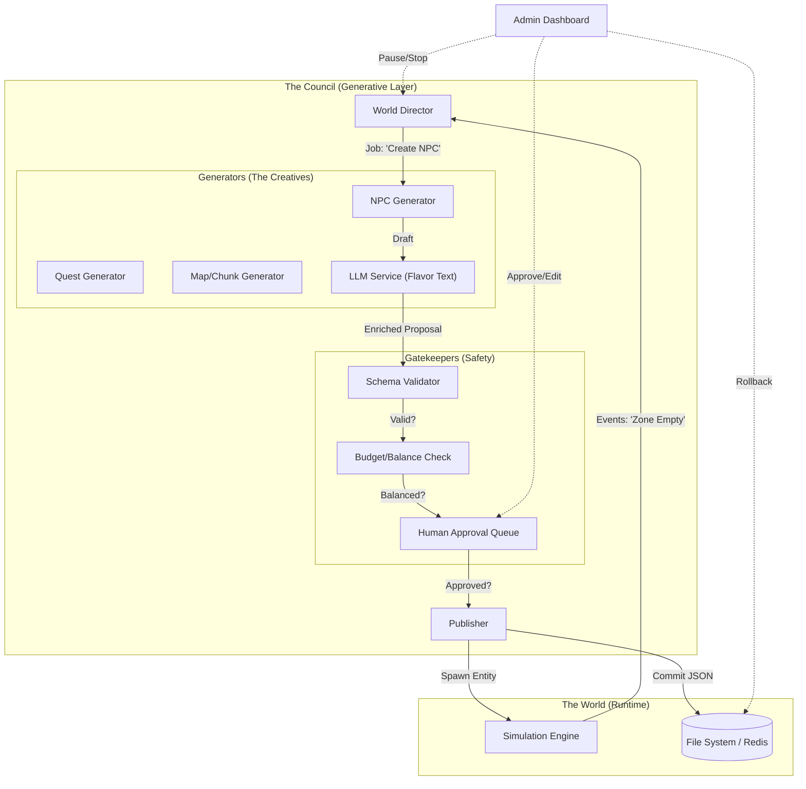

# Generative World Engine Plan (Ourobouro)

## 0) Intent
You want to author a **static base world**, hit **GO**, and then have the game run as a “living” cyberpunk MUD:
- world events
- NPCs / enemies
- quests
- world expansions (new blocks/buildings/rooms)
- new items / weapons / armor

The key is to make this feel infinite **without** letting an LLM destabilize gameplay, balance, or persistence.

---

## 1) Current Baseline (what we’re building on)
From the current project:
- Node.js + TypeScript server + WebSocket real-time multiplayer
- Redis persistence and object reconstruction
- Entity Component System (ECS) with component indexing
- Type-safe JSON protocol + Zod validation
- Persistent 20x20 cyberpunk city + zones + NPC types + inventory/equipment system :contentReference[oaicite:1]{index=1}

This plan assumes we keep that core, and add a **generation pipeline + governance layer** around it.

---

## 2) High-level recommendation
### Keep 1 “authoritative simulation engine” + add generator services
**Do not** make the LLM the game engine.

Instead:
1. **Simulation Engine (authoritative):** deterministic-ish ECS tick + commands + combat + persistence.
2. **World Director (governor):** A **Reactive** system that decides *what* should be generated based on events (e.g., "Player entered empty Zone X").
3. **Generator(s):** produce “content proposals” (NPC templates, quest graphs, items, buildings) using:
   - procedural tables/grammars (fast, reliable)
   - **LLM Abstraction Layer** (Gemini or Local LLM via LM Studio) for *flavor text + dialogue + names* (never raw stats as source-of-truth).
4. **Validation & Balance Gate:** rejects unsafe/overpowered/invalid proposals; normalizes into your canonical schemas.
5. **Publisher:** commits approved content into the live world as an atomic “patch”.

**Yes:** multiple “engines” that talk to each other — but only one is authoritative.

---

## 3) Architecture (practical)
### Option B (recommended): “Single authoritative server + sidecar generators”
Keep your current server as-is; add background workers:
- `server` (authoritative gameplay)
- `gen-worker` (async jobs for procedural generation)
- `llm-worker` (abstracted provider: Gemini / Local 4090)
- `admin-ui` (Observability Dashboard)

Workers communicate via:
- Redis Streams or BullMQ queues
- publish/subscribe topic(s) for “proposal approved” events

This matches your existing Redis footprint. :contentReference[oaicite:2]{index=2}

### 3.1 The "Council" Diagram

---

## 4) Data model: separate “World State” vs “Content Library”
### World State (runtime, mutable)
- entity instances: player 1023, thug 9911, vending machine 882
- location graph: rooms, exits, occupancy
- inventories, health, cooldowns, timers
- active quests + progress

### Content Library (templates, mostly immutable)
- **Storage:** File-based JSON (git-friendly) in `server/data/generated/`.
- **Hot-Reload:** The Director watches this directory. Manual edits to JSON files are instantly applied to the live game.
- NPC archetypes (components + constraints)
- item archetypes (stats ranges, tags, rarity, crafting rules)
- quest blueprints (nodes, conditions, rewards ranges)
- building blueprints (rooms + hooks + storefront types)
- lore entries / factions / corp catalogs

**Generation produces templates first**, then the Director instantiates them as entities.

---

## 5) “Physicalized” items & constraints (how to keep it sane)
Every generated thing must comply with:
- **Canonical schemas** (Zod)
- **Constraint rules** (hard bounds + relationships)
- **Balance budgets** (power, economy value, drop rate)

### Example: Item Budget
Define a “Power Budget” system:
- each weapon has `budgetPoints`
- damage, crit effects, accuracy, ammo efficiency, special procs spend points
- rarity sets budget range

LLM may suggest “a gun that shreds armor”, but the gate decides:
- whether that effect exists
- how strong it is
- its rarity and cost

---

## 6) Generation pipeline (proposal-based)
### 6.1 Proposal object (core concept)
Generator outputs a **proposal**:
- `type`: NPC | ITEM | QUEST | BUILDING | EVENT | WORLD_EXPANSION
- `seed`: deterministic reproduction
- `payload`: canonical-ish JSON (must validate)
- `flavor`: optional strings (dialogue, descriptions)
- `tags`: corp, district, threatLevel, rarity
- `dependencies`: required templates/effects
- `tests`: optional invariants

### 6.2 Stages
1. **Trigger** (Director): “Player entered unmapped Zone (15, 22)”
2. **Draft** (Procedural): tables/grammars create skeleton
3. **Enrich** (LLM): names, barks, quest text, item description
4. **Validate** (Zod + rules)
5. **Balance** (budget scoring + sim checks)
6. **Approve** (signed/hashed proposal)
7. **Publish** (Write JSON to `server/data/generated` + spawn into world)

No stage writes directly to the live world except Publish.

---

## 7) World Director: deciding WHAT to generate
Director is a rules engine + scheduler, not an LLM.

**Reactive Model:**
- **Trigger:** Player moves to edge of map -> **Action:** Generate new chunk.
- **Trigger:** Player kills boss -> **Action:** Generate power vacuum event.
- **Trigger:** Economy inflation > 5% -> **Action:** Generate gold sink merchant.

**Director Personality (Configurable):**
- **Chaos Slider:** (Low = predictable; High = random events/weirdness).
- **Aggression Slider:** (Low = easy mobs; High = boss spawns/invasions).
- **Expansion Slider:** (Low = fill existing rooms; High = aggressive sprawl).

**Observability:**
- All Director decisions and Proposal states are logged to a persistent stream (JSONL or Redis Stream).
- **Admin UI:** A web interface to view the "Brain" of the world.
    - Timeline of events.
    - "Why did you do that?" trace for every generation.
    - Manual override/rollback controls.

---

## 8) World expansion without breaking persistence
### 8.1 Organic Growth (City Sprawl)
- **Not an Infinite Plane:** The world grows like a real city, not a Minecraft map.
- **Triggers:**
    - **Population Density:** "Sector 7 is overcrowded -> Build a new residential block nearby."
    - **Exploration Pressure:** "Players keep hitting the dead-end at 5th Street -> Extend the road."
    - **Narrative Necessity:** "The 'Red Dragon' faction needs a HQ -> Build a skyscraper in the Industrial District."
    - **Quest Saturation:** "All available quests in the Slums are completed/stale -> Open a new sewer dungeon with fresh content."
- **Mechanism:** The Director identifies a "Growth Point" (an existing exit or empty lot) and proposes a new **Block** (collection of rooms/buildings) to attach there.

### 8.2 Compatibility rules
- never delete player-owned rooms/items
- never invalidate an exit that exists (only add alternate routes)
- migrations must be patchable and reversible

---

## 9) Tech recommendations (concrete)
### In-server (TypeScript)
- **Zod schemas** as the single source of truth.
- **File-based Persistence:** Generated content is saved as JSON files.
- **Seeded RNG:** `seedrandom` for reproducibility.

### LLM Provider
- **Abstraction:** `LLMService` interface.
- **Primary:** **Local LLM via LM Studio** (leveraging your 4090).
    - **Model Recommendation:** `Llama-3-8B-Instruct` (fast, smart) or `Mistral-7B`.
- **Secondary:** **Gemini API** (for complex creative writing if local is busy).

### Observability Dashboard
- **Stack:** React + Tailwind (part of existing client or standalone).
- **Features:**
    - **Master Control:** Big "STOP" and "GO" buttons to pause/resume the entire automation pipeline immediately.
    - Live feed of Director logs.
    - Diff view of Proposals (Before vs After Validation).
    - "God Mode" buttons (Force Generate, Rollback).

---

## 10) Interfaces: events and commands
### Core events (publish/subscribe)
- `Director.GenerationRequested`
- `Generator.ProposalCreated`
- `Validator.ProposalRejected`
- `Validator.ProposalApproved`
- `Publisher.ContentPatched`
- `World.SpawnedEntities`
- `Director.Paused`
- `Director.Resumed`

### Command boundary
Players interact only with the Simulation Engine. Generators never handle player commands.

---

## 11) Guardrails (non-negotiable & dynamic)
We will implement a **Dynamic Guardrail System** that allows you to tune safety parameters in real-time via the Admin UI (or a config file) without restarting.

### 11.1 Types of Guardrails
1.  **Validation (Hard Limits):**
    - Zod Schemas: "An item MUST have a name and ID."
    - Integrity Checks: "A room MUST have at least one exit."
2.  **Budgets (Soft Limits):**
    - **Power Budget:** "Max weapon damage = 50."
    - **Economy Budget:** "Max gold drop = 100."
    - **Rarity Budget:** "Only 1 Legendary item per 100 generations."
3.  **Throttles (Rate Limits):**
    - "Max 5 generation jobs per minute."
    - "Max 1 active expansion job at a time."
4.  **Content Filters:**
    - Banned words list (profanity/slurs).
    - Banned themes (configurable via prompt constraints).

### 11.2 Control Mechanisms
- **Human-in-the-Loop:** Optional "Require Approval" mode. The Director pauses after validation, waiting for you to click "Approve" (or edit the JSON) in the Dashboard.
- **Granular Undo:** Revert specific proposals (e.g., "Undo just the Rat King spawn") without rolling back the entire server.
- **Snapshot & Rollback:** The ultimate safety net.
- **Auto-Snapshot:** The Director automatically triggers a snapshot before any "High Risk" operation (e.g., World Expansion, Mass Event).
- **Emergency Stop:** Instantly halts the Director.
- **Hot-Swap Config:** You can edit `guardrails.json` or use sliders in the Admin UI to change budgets/throttles instantly.

---

## 12) Implementation milestones (order matters)
### Milestone 0 — Safety Net
- [x] Implement `SnapshotService` (Backup/Restore scripts).
- [x] Verify rollback works 100%.

### Milestone 1 — Schemas + Proposal system + Guardrails
- [x] Create `schemas/proposals.ts`
- [x] Define `Proposal<T>` types.
- [x] Implement `GuardrailService` (loads config, validates rules).
- [x] Implement `validateProposal()` (Zod) + `scoreBudget()` (dynamic rules).

### Milestone 2 — Observability UI (The Dashboard)
- [x] `/admin` route with real-time socket connection.
- [x] `DirectorLog` component for live system stream.
- [x] `Director.pause()` and `Director.resume()` endpoints.
- [x] Master Control: STOP/GO buttons with emergency halt.
- [x] Director Personality: Chaos, Aggression, Expansion sliders + Toggles.
- [x] Human-in-the-loop: Approval Queue for generated content.
- [x] Snapshot Utility: Create, List, Delete, and Rollback (with double confirmation).
- [x] Dynamic Guardrails: Real-time budget editing and safety toggles.
- [x] Tabbed Interface: Clean organization of controls, logs, and snapshots.
- [x] Restricted Generation: Toggle to limit AI to "Glitch Door" areas.

### Milestone 3 — Procedural generators (The Drafting Stage)
- [x] NPC archetype generator (Components + Constraints).
- [x] Item generator (Stats + Rarity + Budgets).
- [x] Quest blueprint generator (Nodes + Rewards).
- [x] Room/Building generator (World Expansion).
- [x] File-based publisher (Writes JSON to `server/data/generated`).

### Milestone 4 — LLM Integration
- [ ] Implement `LLMService` (LM Studio / Gemini adapter).
- [ ] Add "Enrich" stage to pipeline (Flavor text, rationale).

### Milestone 5 — Infinite World
- [ ] Implement `ChunkSystem` (coordinate management).
- [ ] "Edge of World" detection triggers.
- [ ] Chunk generation logic.

---

## 13) “Definition of Done” for GO button
When you “hit GO”, the system should:
- Snapshot the current clean state.
- Start Director scheduler.
- Start job queue workers.
- Continuously generate proposals based on player activity.
- Approve/publish patches to JSON files.
- Spawn events/NPCs/quests into the world.
- Show all activity on the Admin Dashboard.

---

## 14) Next file(s) to create
- `server/src/services/SnapshotService.ts` (Milestone 0)
- `server/src/generation/types.ts`
- `server/src/generation/proposals/schemas.ts`
- `server/src/generation/validator.ts`
- `server/src/worldDirector/director.ts`
- `server/src/generation/llm/LLMService.ts`

---

## 15) Open questions (Resolved)
- **Database:** File-based JSON (no SQL needed yet).
- **World Topology:** Infinite Plane (Minecraft style).
- **LLM:** Local (LM Studio) or Gemini.
- **Observability:** Required (Web UI).
- **Safety:** Snapshot/Rollback required.
