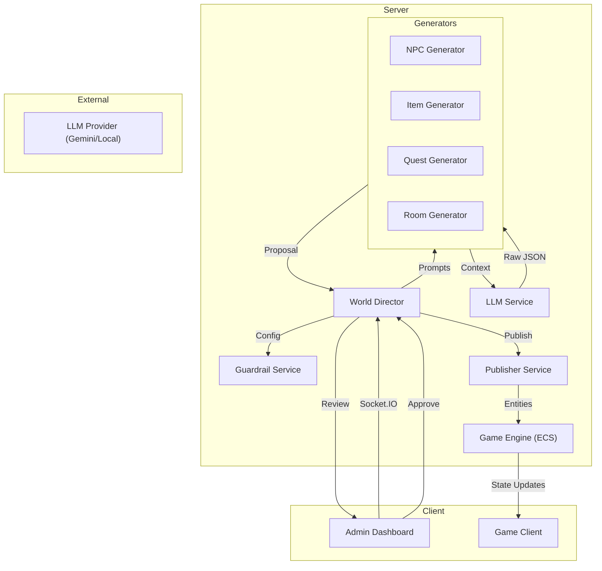

# Admin Dashboard Guide

The Admin Dashboard is the control center for the Ouroboro game world. It allows administrators to manage the AI Director, oversee content generation, configure guardrails, and manipulate the game state in real-time.

## Architecture

The Ouroboro system integrates Large Language Models (LLMs) into the core game loop through a "World Director" system. This system acts as an intermediary between the raw creativity of the LLM and the strict rules of the game engine.

## Features & Usage

### 1. Director Control
The main "Director" tab provides high-level control over the AI's autonomy.

*   **Emergency Stop / Resume**: A large toggle button to instantly pause or resume all automated generation loops. Use this if the AI starts generating undesirable content.
*   **Personality Settings**: Adjust the "Personality" of the Director.
    *   **Chaos**: Influences the randomness and unpredictability of events.
    *   **Aggression**: Determines the hostility of generated NPCs and the danger level of quests.
    *   **Expansion**: Controls how frequently the world grows (new rooms/chunks).
*   **Manual Triggers**: Buttons to force the immediate generation of specific content (NPC, Mob, Item, Quest, Expansion) regardless of the current automation timer.
    *   **WORLD_EXPANSION**: Generates a new room at a random location (0-100).
    *   **Create BOSS**: Generates a high-threat entity with boosted stats and guaranteed legendary loot.
    *   **World Event**: Triggers a global event (e.g., Mob Invasion) that affects the entire world.

### 2. Guardrails & Budgets
This section defines the strict limits within which the AI must operate.

*   **Feature Toggles**: Enable or disable specific types of generation (e.g., turn off "Enable Expansions" to stop the map from growing).
*   **Budgets**: Numerical limits for game balance.
    *   *Example*: Setting `Max Weapon Damage` to 50 ensures the AI never creates a "God Slayer Sword" with 1000 damage, even if it writes a cool description for it.
    *   *Usage*: Click on a budget value to edit it.

### 3. Content Approvals
When `Require Human Approval` is enabled, all AI-generated content appears here as a "Proposal" before entering the game.

*   **Review**: Read the Name, Description, and Rationale provided by the AI.
*   **Approve**: Click the green checkmark to publish the content to the live game.
*   **Reject**: Click the red X to discard the proposal.

### 4. LLM Configuration
Manage the connections to Large Language Models.

*   **Profiles**: Create different profiles for different tasks (e.g., a "Creative" profile using GPT-4 for descriptions, and a "Logic" profile using a local Llama-3 model for stats).
*   **Roles**: Assign roles (Creative, Logic, Default) to specific profiles to optimize cost and performance.

### 5. World Map (Expansions)
A visual grid representing the game world.

*   **Navigation**: The grid shows generated chunks (green).
*   **Manual Generation**: Click any empty cell to force the AI to generate a new room/chunk at that location.
*   **Deletion**: Toggle "Delete Mode" and click a green cell to permanently delete that chunk and its contents.

### 6. Item & NPC Management
Direct access to the game's registries.

*   **Items / NPCs Tabs**: View a list of all currently loaded items and NPCs.
*   **Search**: Filter the list by name or type.
*   **Delete**: Remove an entity from the game. *Note: This deletes the definition, so new instances cannot be spawned, but existing instances in the world may persist until a restart.*

### 7. Snapshots
Manage world state backups.

*   **Create Snapshot**: Save the current state of all entities (players, items, rooms) to a file.
*   **Restore**: Rollback the world to a previous state. *Warning: This overwrites current progress.*
*   **Auto-Snapshot**: If enabled in Guardrails, the system will automatically create snapshots before high-risk operations (like large map expansions).

### 8. Logs
A real-time feed of system events.

### 9. World Events & Bosses
The Director can orchestrate large-scale events and generate powerful adversaries to challenge players.

*   **World Events (Mob Invasion)**:
    *   **Trigger**: Can be triggered manually via the "World Event" button or automatically by the Director based on the **Aggression** personality trait.
    *   **Effect**: Spawns 10-20 aggressive mobs in random locations across the world.
    *   **Loot**: Invasion mobs have a 20% chance to carry `RARE` grade items.
    *   **System Alerts**: The system broadcasts a global warning to all players when an invasion begins.
*   **Bosses**:
    *   **Trigger**: Manual trigger via the "Create BOSS" button.
    *   **Scaling**: Bosses are automatically scaled to **5x Health** and **2x Attack/Defense** compared to standard NPCs.
    *   **Loot**: Bosses are guaranteed to drop at least one `LEGENDARY` item.
    *   **Approval**: Bosses create a **Proposal** that must be reviewed and approved by an admin before they are published to the registry.
*   **Auto-Approval**: World Event mobs (Invasions) bypass the approval queue for immediate impact.

### 10. Loot System
All NPCs (including Bosses and Invasion Mobs) now participate in a dynamic loot system.
*   **On Death**: When an NPC is defeated, it drops all items in its inventory (hands and equipment) and any items defined in its `Loot` component onto the ground.
*   **Visibility**: A message is broadcast to the attacker when loot is dropped.

